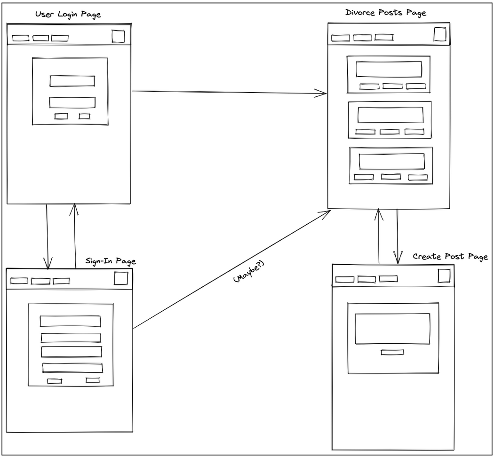
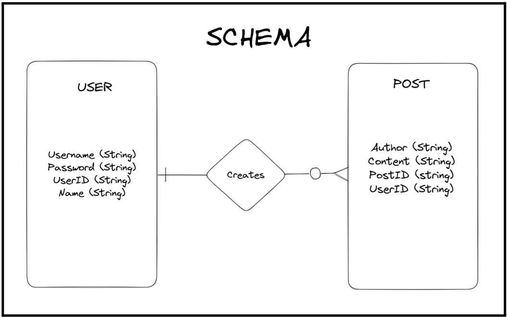
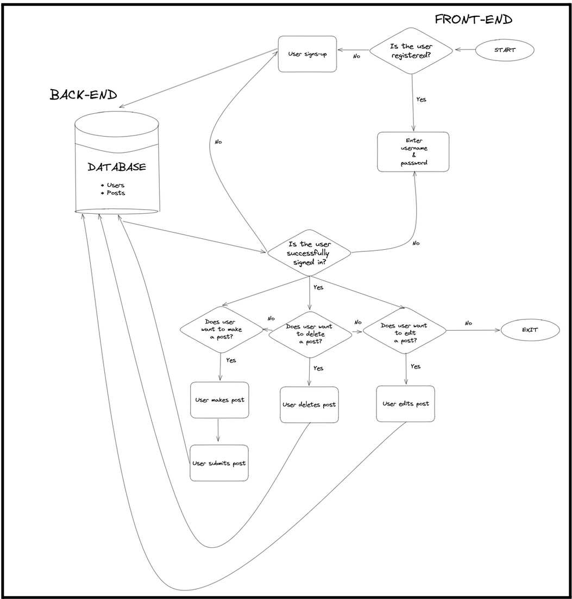
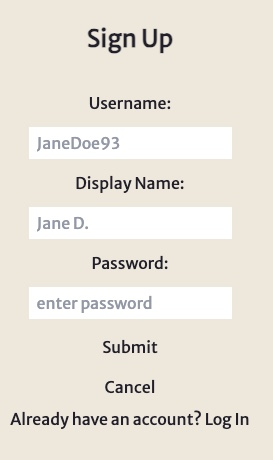
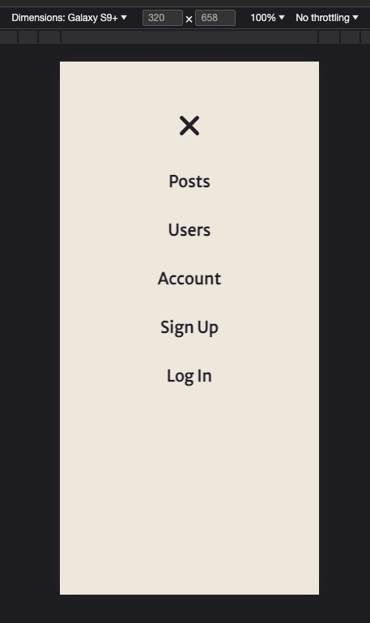
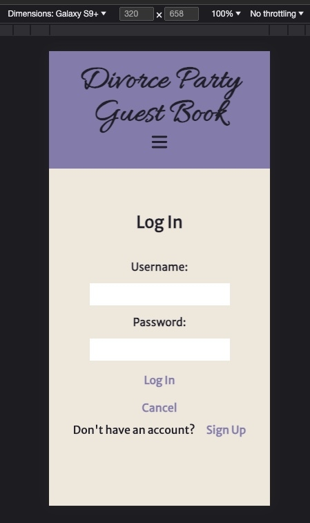

# Project 3 - MERN Guest Book

## Overview

1. Description
2. Deployment Link
3. Installation
4. Technologies Used
5. Deliverables
6. Planning
7. Build Process
8. Challenges
9. Wins
10. Key Learnings & Takeaways
11. Future Improvements

## 1. Description

A MERN Full-Stack Website that allows users to sign-up for an account and subsequently login into and ou of the account. They can update their password and username as well as read, post, edit and delete comments in a Divorce Party Guest Book.
This project was implemented as a group project consisting of four General Assembly Software Engineering Immersive students. The app was developed to help recent divorcees enjoy their divorce party to the fullest and will hopefully let users re-live all the happy memories.


## 2. Deployment link

https://hpramanathan.github.io/project3-mernstack-app/

## 3. Installation

- Front end dependencies:
  - package manager used: npm - v9.6.7
  - https://www.npmjs.com/package/npm
  - to install dependencies, run the following command in both the front end and back end directories:

```
npm install
```

## 4. Technologies Used

### Front End

The front end of this application is based in ReactJS (v18.2.0), JavaScript, JSX and CSS.

- The front end was set up using the 'create-react-app' command
  - https://create-react-app.dev/

```zsh
create-react-app frontend
```

Additional packages:

- routing: react-router (v6.11.2)
  - https://www.npmjs.com/package/react-router
- authentication: bcryptjs (v2.4.3)
  - https://www.npmjs.com/package/bcryptjs
- styling: TailwindCSS (v3.3.2)
  - https://tailwindcss.com/docs/guides/create-react-app

### Back End

- the back end was set up using the following command:

```zsh
npm i express mongoose
```

Additional packages:

- express (v4.18.2)
  - https://www.npmjs.com/package/express
- CORS (v.2.8.5)
  - https://www.npmjs.com/package/cors
- dotenv (v.16.0.3)
  - https://www.npmjs.com/package/dotenv
- mongodb (v5.4.0)
  - https://www.npmjs.com/package/mongodb
- mongoose(v7.1.0)
  - https://www.npmjs.com/package/mongoose
- nodemon(v2.0.22)
  - https://www.npmjs.com/package/nodemon
- authentication:
  - bcrypt (v5.1.9)
    - https://www.npmjs.com/package/bcrypt
  - jsonwebtoken (v.9.0.0)
    - https://www.npmjs.com/package/jsonwebtoken
  - passport (v0.6.0)
    - https://www.npmjs.com/package/passport
  - passport-jwt (v.4.0.1)
    - https://www.npmjs.com/package/passport-jwt
- Icons
  - All icons used are Scalable Vector Graphics from iconify
  - https://iconify.design/

### Deployment

- MongoDB Atlas
  - used to deploy the MongoDB database
  - https://www.mongodb.com/cloud/atlas/register
- Heroku
  - used to deploy the back end
  - https://www.heroku.com/
- Netlify
  - used to deploy the front end
  - https://www.netlify.com/

### Additional tools used:

- Git / GitHub: version control
  - https://git-scm.com/
  - https://github.com/https://github.com/
- Postman
  - used to test the API endpoints
  - https://www.postman.com/
- Visual Studio Code (VSCode)
  - code editor used for writing CSS, JSX and JavaScript
  - https://code.visualstudio.com/
- Google Chrome browser
  - used for launching the website and displaying the application Google Chrome
  - Google Chrome Developer Tools: For troubleshooting and debugging
  - https://www.google.com/intl/en_uk/chrome/
- excalidraw
  - used for building the wireframe + ERD
  - https://excalidraw.com/

## 5. Deliverables

### MVP Requirements

- thoroughly documented README.md file
- Excalidraw or Whimsical document to convey the data flow with component hierarchy included.
- proper indentation, semantic variable names, adhere to naming conventions
- Remove
  - unnecessary boilerplate React files and code
  - console.log()s
  - commented out code
- All team member should:
  - contribute equally
  - Have a solid understanding of the entire project, even the features implemented by other team members.
  - Take time to pair program with teammates to reinforce learning.
  - Be prepared to explain sections of code that were written by teammates.
- Front end:
  - Working, interactive React app, built using npx create-react-app client
  - at least 6 separate, rendered components in an organized and understandable React file structure.
  - Use only React for DOM Manipulation.
  - Consume data from an API, and render that data in your components.
  - Utilize React Router, for client-side routing.
  - Authentication
- Back end:
  - working generic router actions for CRUD using Express, Mongoose, and MongoDB.
  - Have at least 2 models
  - Have full CRUD on at least one of your models
  - Be able to Add/Delete on any remaining models
  - Authentication
- Styling:
  - styling with CSS
    - flexbox or Grid
  - responsive design on 2 screen sizes (including desktop) using a media query (mobile)
- Deployment:
  - Deploy the fully functional front-end via GitHub Pages or Vercel
  - Deploy the back-end via Heroku (or vercel)
  - Deploy the MongoDB database on MongoDB Atlas

### Stretch goals

- more than 2 models
- css framework e.g. TailwindCSS or bootstrap

## 6. Planning

- The team working on this project included 4 members:

  - [Hari Ramanathan](https://github.com/hpramanathan) (GitHub Code Owner/Team Lead)
  - [Benjamin Khoury](https://github.com/khouryb)
  - [Franziska Kissling](https://github.com/FrankieSlinn)
  - myself, [Catherine Loesch](https://github.com/catherineloesch)

- Timeframe: 9 days
  - The deliverables were issued to the team on 04/05/2023 with the submission deadline and presentation date on 12/05/2023

<br>

### Day 1: 04/05/2023

On day 1, the team brainstormed together to develop the project concept, design, coding approach and working schedule.
The team name was picked (Chewing the CRUD) and agreed on a concept: A virtual guest book for an event, specifically a divorce party. The team then discussed each member's strengths and weaknesses, the details of which were recorded in the [Team Expectations Setting Document](https://docs.google.com/document/d/1QG9nAynGNKvsSN4Jzfesn4T-DbXv5GxTEtXh-bZMAAM/edit). <br>

Next, the team devised the user stories, a wireframe, schema and flow chart containing the database models that had been agreed upon earlier in the day:

### wireframe



<br>

### User Stories

- As a user I should be able to access the website from different devices/browsers.
- As a user I should be able to register with a username and password.
- As a user I should be able to login with my username and password.
- As a user I should be able to view all posts.
- As a user I should be able to view my posts.
- As a user I should be able to write new posts.
- As a user I should be able to delete my posts.
- As a user I should be able to edit my posts.
- As a user I should be able to log off from the website.

<br>

### schema



<br>

### Database Models Flowchart



<br>

After setting up the git repository for the project, each team member created their own local development branch.

### Day 2: 05/05/2023

With the git repository and development branches et up, the team divided up the tasks and started the coding part of the project:
I started the front end by setting the react application witht the 'npx create-react-app' command and installing react-router.

Next, the team created the User and Post models.

```JavaScript
const mongoose = require('mongoose')
const Schema = mongoose.Schema;

const userSchema = new Schema({
    username: { type: String, required: true },
    password: { type: String, required: true },
    name: { type: String, required: true },
    posts: [{
        type: mongoose.Schema.Types.ObjectId,
        ref: "Post"
    }]

}, { timestamps: true })

const User = mongoose.model('User', userSchema)

module.exports = User;
```

```JavaScript
const mongoose = require('mongoose')
const Schema = mongoose.Schema;

const postSchema = new Schema({
    author: { type: String, required: true },
    title: String,
    content: { type: String, required: true }
}, { timestamps: true })

const Post = mongoose.model('Post', postSchema)

module.exports = Post;
```

Finally, I create all the necessary CRUD functions for the User model for the frontend to make fetch requests to the database and the corresponding backend routes for:

- INDEX
- CREATE
- SHOW
- UPDATE
- DESTROY

backend route for DELETE User action:

Once the models were completed the team focused on generating the backend routes for CRUD functionality.
I worked on the routes for the User model. Below is an example of one of those routes (the DELETE route for the User model):

```JavaScript
router.delete('/users/:id', (req, res) => {
    User.findByIdAndRemove(req.params.id)
    .then(user => {
        if (user) {
            res.json(user)
        } else {
            res.status(404).json({
                error: {
                    name: 'DocumentNotFound',
                    message: "The provided ID doesn't match any documents"
                }
            })

        }

    })
    .catch((error) => {
        console.log(error)
        res.status(500).json({error: error})
    })
})


```

After all the backend routes had been successfully tested, in the Postman API platform I started implementing the frontend routes for the User model. Below is the example of the DELETE fetch request on the frontend:

```JavaScript
export const deleteOneUser = async (id) => {
    const fetchOptions = {
        method: "DELETE",
        headers: {
            "Content-Type": "application/json",
            "Accept": "application/json"
        }};

    const url = `http://localhost:5000/users/${id}`
    const response = await fetch(url, fetchOptions);

    if (!response.ok) {
        const errorMessage = await response.text();
        throw new Error(errorMessage);
    }

    return response.json();
}
```

The rest of the team implemented CRUD functions for the Post model and generated seed data for the database.

### Day 3: 06/05/2023

Since the team had decided on using a CSS framework to do the styling, I also installed tailwindCSS for react. I then proceeded to add a form in the front end to add new users to the database:



### Day 4: 07/05/2023

On the fourth day I continued my tainwindCSS learning curve and created a responsibe navigation bar for the website.




I also added a login page for users that are already in the databse:



### Day 5: 08/05/2023

On the fifth day of development the ream focused on the deployment of the frontend to github pages and getting started on user authentication.

I used the bcrypt package to make sure that passwords entered by users are hashed and salted before being stored in the database, making sure there are no plain-text passwords stored in the backend.

```JavaScript

router.post('/users', async (req, res) => {

    try {
        //Check if username already exists in db
        //If it does, send error
        const usernameExists = await User.find({username: req.body.username})

        if (usernameExists.length > 0) {
            res.send({error: "username already exists"})

        } else {
            //salt + hash password entered by user
            const salt = await bcrypt.genSalt()
            const hashedPassword = await bcrypt.hash(req.body.password, salt)

            const newUser = {
                username: req.body.username,
                password: hashedPassword,
                name: req.body.name,
                posts: []
            }

            //create new User document
            User.create(newUser).then(function(user) {
                res.status(201).json(user)
            })
        }
    } catch {
        res.status(500).json({error: 'Internal Server Error'})    }
})

```

### Day 6: 09/05/2023

jwt passport

```JavaScript
//LOGIN when user tried to log into account with username + password
router.post('/users/login', async (req, res) => {

    //retrieve user document from db by username (usernames are unique)
    const user = await User.find({username: req.body.username})

    if (user.length == 0) { // no record found in database
        res.status(400).json({error: 'user does not exist in database'})

    } else { // user exists in db

        try {   //check if password user entered matches password in db
            if (await bcrypt.compare(req.body.password, user[0].password)) {

                const payload = {
                    id: user[0]._id,
                    username: user[0].username
                }

                //Build JWT
                const token = jwt.sign(payload, jwtOptions.secretOrKey, {expiresIn: 432000}) // 5 days -> 432000s

                //Send JWT back to user
                res.status(201).json({
                    success: true,
                    token: token,
                    user: user
                })

              } else { // password user entered does not match password in db
                res.status(401).json({error: 'Invalid username or password'})
              }
        } catch(error) {
            res.status(500).json({error: error})

        }
    }
})
```

The team also worked on etablishing a connection with the Mongo Database and producing seed data to populate it.

### Day 7: 10/05/2023

passport jwt

The user authentication was developed using bcrypt for password hashing and Passport JWT for user authentication. The authentication was integrated into the routes.

### Day 8: 11/05/2023

add account page for user
add logout
user specific posts +CRUD

### Day 9: 12/05/2023 -> Submission deadline + Project Presentation

## CHALLENGES

- Seeding: The team faced challenges while implementing the seed file to populate initial data into the database. It required careful handling and synchronization to ensure the data was properly seeded.
- Authentication: Developing user authentication posed challenges. The team utilized bcrypt for password hashing and Passport JWT for user authentication. Integrating authentication into the routes required careful implementation and testing.

## WINS

- Authentication: Successfully implementing user authentication using bcrypt for password hashing and Passport JWT for user authentication was a significant win for the team. It ensured secure access and protected user data.
- Tailwind CSS: Utilizing the Tailwind CSS framework for layout and styling proved to be a success. The chosen color scheme and styling enhanced the overall design of the website.
- Git conflicts: The team effectively managed Git conflicts by frequently committing and pulling changes from the repository. This approach minimized conflicts and facilitated smooth collaboration.

## KEY LEARNING/TAKEAWAYS

- Good communication is key when working in a team that contributes to the same git repository.
- Reviewing git conflicts as a team can avoid issues of code getting deleted.

## BUGS

- One notable challenge encountered at the end of the project was the issue with the Front-End deployment prep and its relation to the (back-end) Heroku server. This connectivity issue caused a disruption in the expected flow of data and functionality, hindering the full operation of the website. The team worked diligently to troubleshoot and resolve this bug, but were unable to do so. Hence the website is only accessible via a _localhost_.

## FUTURE IMPROVEMENTS

- Create a file upload facility for user profile pictures and party pictures within a post: Enhancing the website by adding a file upload feature would allow users to upload profile pictures and images related to their divorce party posts, further enriching the user experience.
- Get quotes about divorce via an external API: Integrating an external API that provides quotes specifically related to divorce would add interesting and relevant content to the website. It could enhance the overall user engagement and provide additional value to the users.
